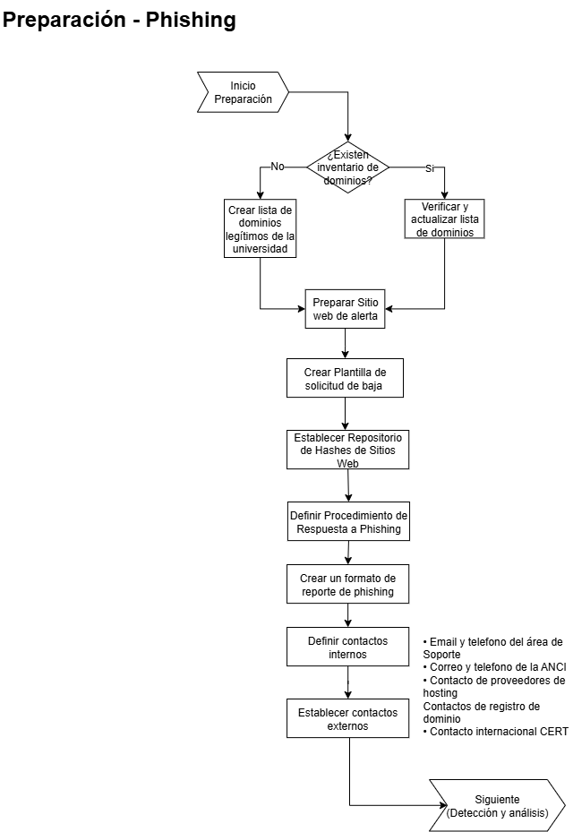
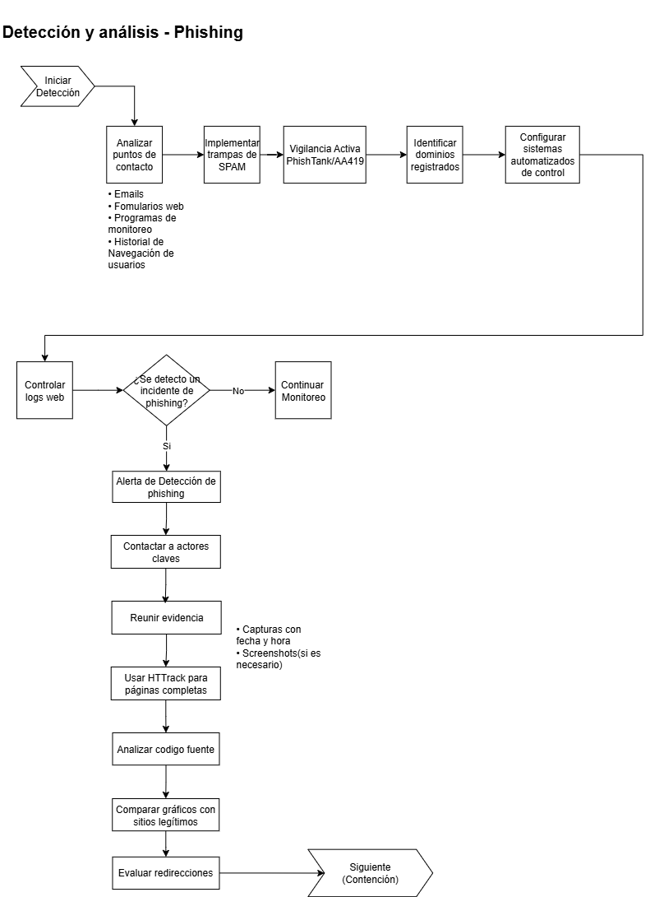
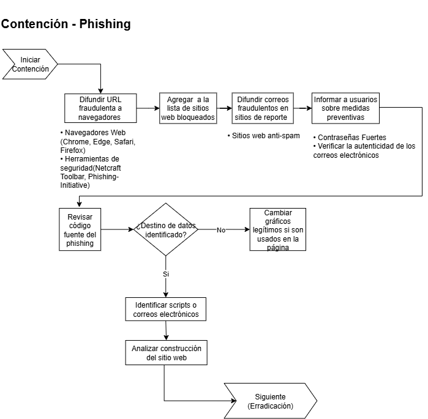
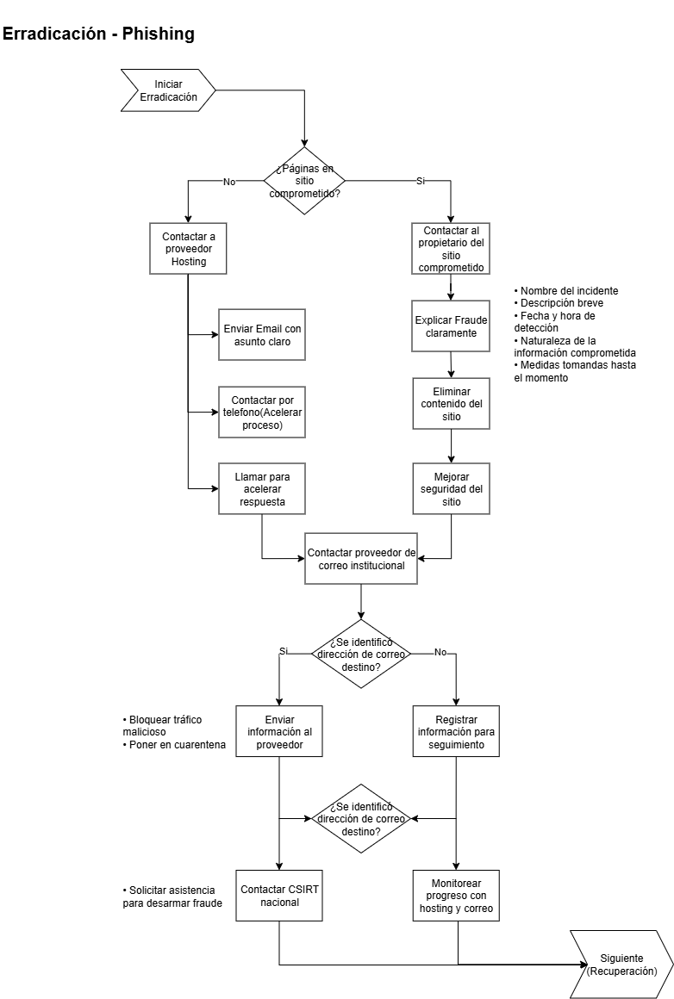
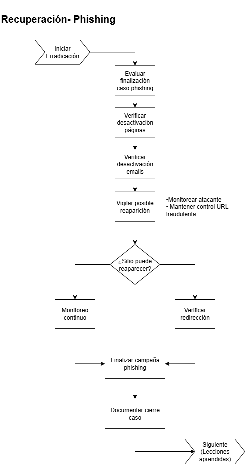
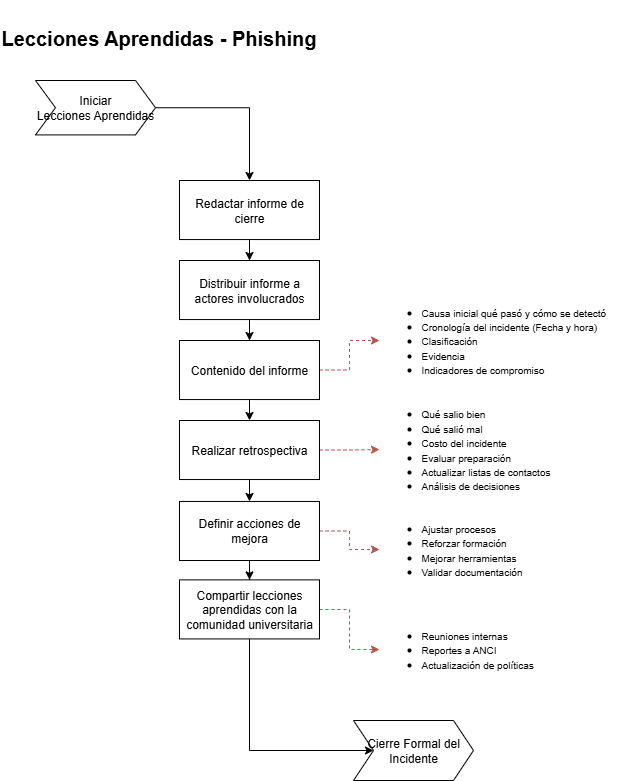

# 🛡️ Playbook 03: Phishing
**Código:** PB-ULA-003

**Última actualización:** 17/Jul/2025

**Responsable de revisión:** 

**Tipo de Incidente:** Confidencialidad – Ataques de suplantación para robo de credenciales  

**Versión:** 1.0

---

## 1️⃣ Preparación

**Objetivo:** Establecer contactos, definir procedimientos, reunir información para ahorrar tiempo durante un ataque.

### Acciones: 
- Crear una lista de todos los dominios legítimos que pertenecen a la universidad. Esto le ayudará a analizar la situación y evitar que se inicie un procedimiento de baja de un sitio web olvidado pero legítimo.

- Preparar un sitio web alojado en la infraestructura tecnológica de la universidad, listo para ser publicada en cualquier momento para advertir a la comunidad universitaria sobre un ataque de phishing en curso. Preparando un procedimiento claro de implementación.

- Preparar un texto o formato de "pedido de baja" para una solicitud de cancelación de un servicio o cuenta, si es posible en varios idiomas, se va utilizar para todos los casos de phishing.
- Crear un repositorio de hashes de sitios web de la universidad y sus modificaciones recientes para monitorear cambios en los sitios web.
- Defina un procedimiento claro para responder ante phishing y considere incluir
  - Un formato de reporte de phishing.
  - Un procedimiento para el personal de TI para determinar si un sitio web es legítimo o no.

Esto acelerará las cosas cuando se trate de llegar al proveedor de hosting durante el proceso de baja del sitio fraudulento.

### 📇 Contactos Internos
- Mantener una lista de todas las personas involucradas en los registros de nombres de dominio de la universidad.
- Mantener una lista de todas las personas acreditadas para tomar decisiones sobre el incidente y las medidas de protección sobre phishing.

### 🌐 Contactos Externos
Tener varias maneras de ser contactados de manera oportuna (24/7 si es posible):
- Dirección de email fácil de recordar por todos (por ejemplo: ti @ ulagos.cl)
- Correo Electrónico de la ANCI:  ayuda@anci.gob.cl
- Teléfono de la ANCI:   1510

Establecer y mantener una lista de contactos para pedir bajas con:
- Proveedores de hosting
- Registradores de dominios
- Proveedores de correo electrónico

Establecer y mantener contactos Internacionales
- CERT(Computer Emergency Response Team)
    - Un teléfono de contacto: +91-11-24368572
    - Un número de teléfono de emergencia: +91-1800-11-4949
    - una dirección de correo electrónico: info@cert-in.org.in
    - Un número de fax: +91-1800-11-6969

---

## 2️⃣ Detección

**Objetivo:** Detectar el ataque de phishing, evaluar su impacto, y notificar a las partes interesadas.

### Acciones:
- Analizar de cerca todos los puntos de contacto (e-mail, formularios web, etc.)
- Revisar el historial de navegación de los usuarios.
- Implementar trampas de spam para identificar patrones.
- Implementar vigilancia activa de repositorios de phishing, como por ejemplo AA419 o PhishTank.
- Identificar nuevos dominios registrados similares al de la organización.
- Monitorear cualquier lista de correo especializadas a la que tenga acceso, o algún “feed” RSS / Twitter, que le informe sobre casos de phishing.
- Utilizar sistemas automatizados de control de todas estas fuentes, de modo que cada detección active una alarma para tener reacción inmediata.
- Controlar los logs de web. Compruebe que no hay referentes sospechosos que traen visitantes a su sitio web. Este suele ser el caso cuando los sitios web de phishing dirigen al usuario a la página web legítima después de haber sido engañado.

### Involucrar a las partes correspondientes
Tan pronto como se detecte algún incidente de phishing, póngase en contacto con las personas que la Dirección de Informática de la universidad acredite para tomar una decisión.

La decisión de actuar en la página web o e-mail fraudulentos debe tomarse tan pronto como sea posible, en cuestión de minutos.

### Reunir evidencia
- Tomar capturas con fecha y hora de las páginas web de phishing. 
- Utilice una herramienta eficaz para hacer eso, como por ejemplo HTTrack. 
- Tomar todas las páginas del sistema de phishing, no sólo la primera, si hay varias. Si es necesario, hacer capturas de pantalla de las páginas.

### 🔎 Verificación técnica:
- Analizar código fuente de páginas de phishing.
- Comparar gráficos e imágenes con sitios legítimos.
- Evaluar redirecciones de enlaces falsos.

---

## 3️⃣ Contención

**Objetivo:** Mitigar los efectos del ataque sobre el entorno objetivo.

### Acciones:
- Difundir la URL de ataque en el caso de un sitio web de phishing.  
- Utilizar todos las formas que tenga de difundir la URL fraudulenta en todos los navegadores web: usar las opciones de Internet Explorer, Chrome, Safari, Firefox, la barra de herramientas Netcraft, Phishing-Initiative, etc.Esto evitará que los usuarios accedan a la página web mientras se trabaja en la fase de rehabilitación.  
- Difundir el contenido del correo electrónico fraudulento en sitios web / asociados informe de spam.  
- Informar a los afectados sobre medidas de seguridad que pueden tomar para protegerse contra ataques de phishing en el futuro, como utilizar contraseñas fuertes y verificar la autenticidad de los correos electrónicos. 
- Implementar la página de alerta que informe sobre el ataque de phishing actual.
    - En caso de que se vea afectado varias veces a la semana, no solamente despliegue un mensaje de alerta, sino una página de alerta de phishing muy informativa para aumentar la concienciación. Se recomienda implementar un procedimiento para que los usuarios puedan fácilmente informar a los administradores de la universidad si consideran que un sitio web es fraudulento o no.

Revisar el código fuente del sitio web de phishing:
- Ver hacia donde se envían los datos: ya sea a otro contenido de la web que no se puede acceder (un script PHP por lo general), o si se envía por correo electrónico a los autores del fraude.  
  - Mire cómo se ha construido la página de phishing. ¿Los gráficos vienen de una de sus sitios web legítimo, o se almacenan localmente?  
  - Si es posible, en el caso de que se estén tomando los gráficos de uno de sus propios sitios web, puede cambiar los gráficos para mostrar un logotipo de "sitio de phishing" en la página del defraudador.

---

## 4️⃣ Erradicación

**Objetivo:** Adoptar medidas para detener el fraude.

## Acciones 
- Si las páginas de phishing están alojadas en un sitio web comprometido, contactar al propietario del sitio. Explicar claramente el fraude para que puedan tomar las medidas adecuadas: eliminar el contenido fraudulento y mejorar la seguridad del sitio para evitar que el atacante explote la misma vulnerabilidad nuevamente.

- Contactar al proveedor de alojamiento de la página web. 
    - Enviar mensajes de correo electrónico a las direcciones de contacto de la empresa de alojamiento, utilizando un asunto claro y conciso, como "Incidente de seguridad en la página web", incluir descripción breve del incidente de seguridad, la fecha y la hora en que se detecto el incidente de phishing, la naturaleza de la información que se ha visto comprometida y las medidas que se han tomado hasta el momento para contener el incidente.
    - Luego tratar de contactar a alguien por teléfono para acelerar las cosas y obtener una respuesta inmediata.

- Contactar al proveedor de servicios de correo electrónico de la universidad
- En caso de redirección, (el enlace en el e-mail va a menudo redirigida a una URL) baje la redirección poniéndose en contacto con la empresa responsable del servicio.  
- Si se ha averiguado la dirección de correo electrónico destino, proporcione esa información al proveedor de servicios de correo electrónico para que pueda tomar medidas para bloquear el tráfico de correo electrónico malicioso o poner en cuarentena.
- Si la baja de servicio es demasiado lenta, póngase en contacto con el CSIRT nacional, lo que podría ayudar a desarmar el fraude.

---

## 5️⃣ Recuperación

**Objetivo:** Volver al estado previo de funcionamiento.

### Acciones
- Evaluar el final del caso de phishing.  
- Garantizar la desactivación de las páginas fraudulentas y/o la dirección de correo electrónico.  
- Vigilar la posible reaparición del atacante.
- Mantener el control de la URL fraudulenta. A veces un sitio web de phishing puede aparecer varias horas después. En caso que se haya utilizado una redirección y no la hayan bajado, monitorear constantemente.  
- Al final de una campaña de phishing, retire la página de advertencia asociada desde su sitio web.

---

## 6️⃣ Lecciones aprendidas

**Objetivo:** Documentar lecciones aprendidas y fortalecer defensas.

### Informe
Debe incluir:
- Qué pasó y cómo fue detectado.
- Acciones tomadas y tiempos.
- Qué salió bien y mal.
- Costos y consecuencias.

### Retrospectiva:
- Considerar qué pasos de preparación podría haber dado para responder al incidente más rápida o eficientemente.  
- Actualizar las listas de contactos y agregue notas sobre la forma más eficaz de comunicarse con cada parte implicada.  
- Considere cuáles relaciones dentro y fuera de la universidad que podrían ayudar en futuros incidentes.  
- Si se requiere una acción legal, colaborar con el área jurídica de la universidad.
---

## 📄 Referencia 

- **Fuente:** CERT SG 
- **Web:** [cert.societegenerale.com](http://cert.societegenerale.com)  
- **Email:** cert.sg@socgen.com  
