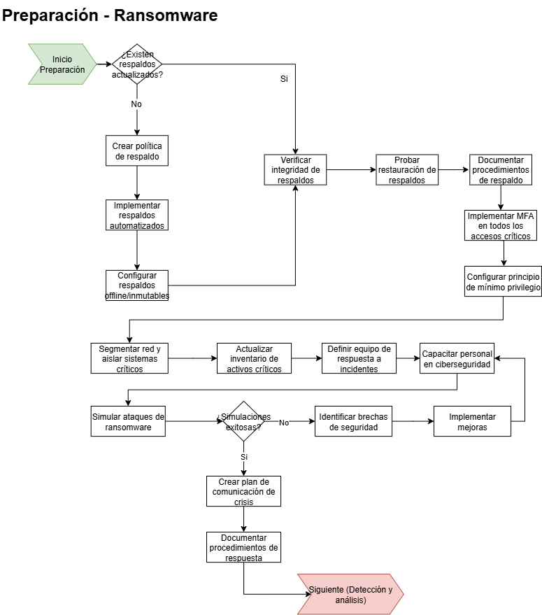
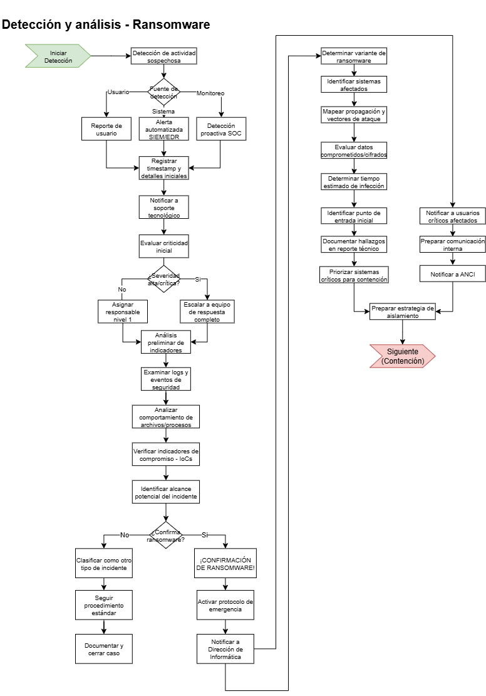
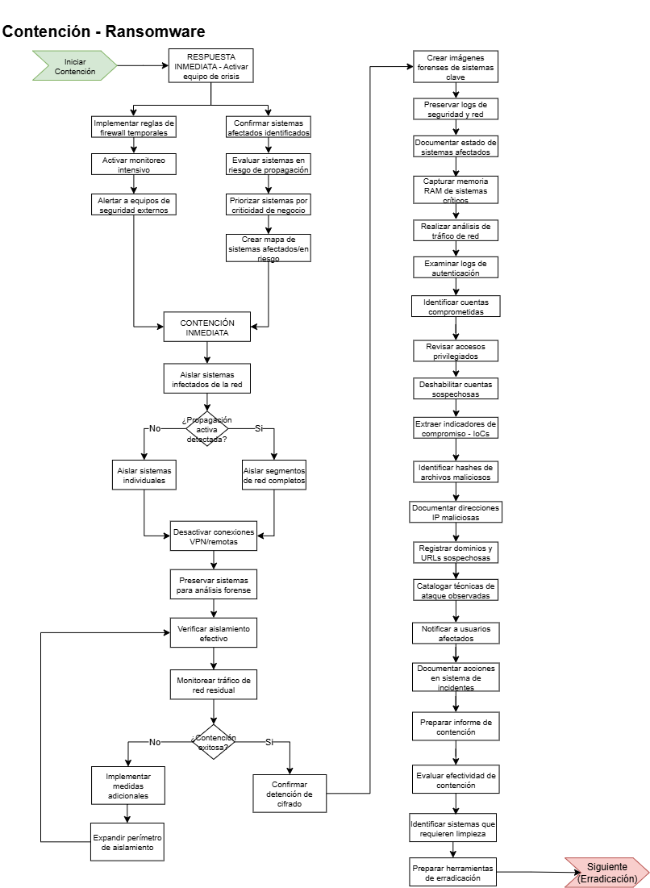
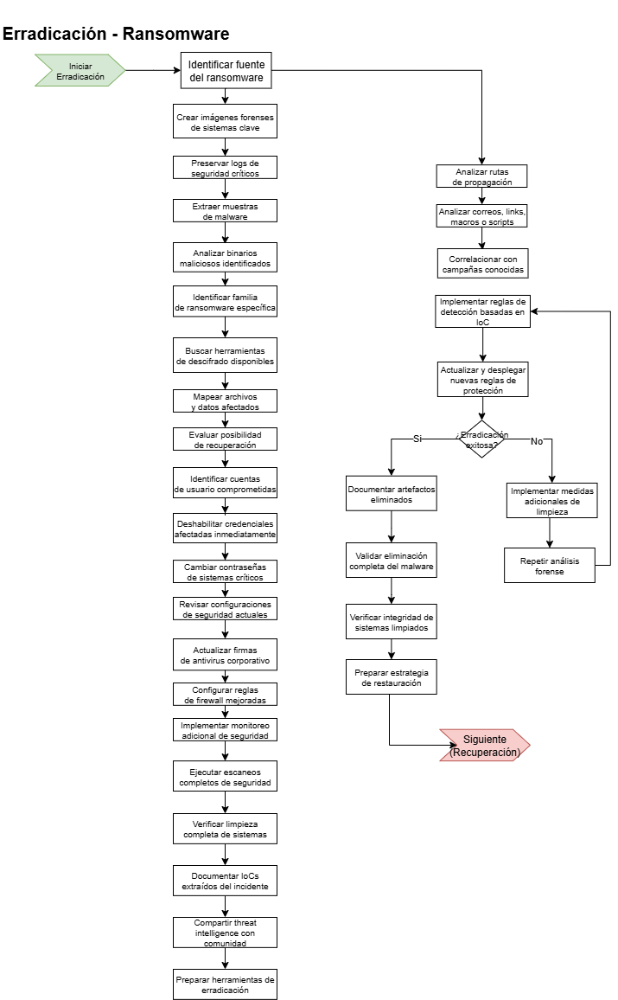
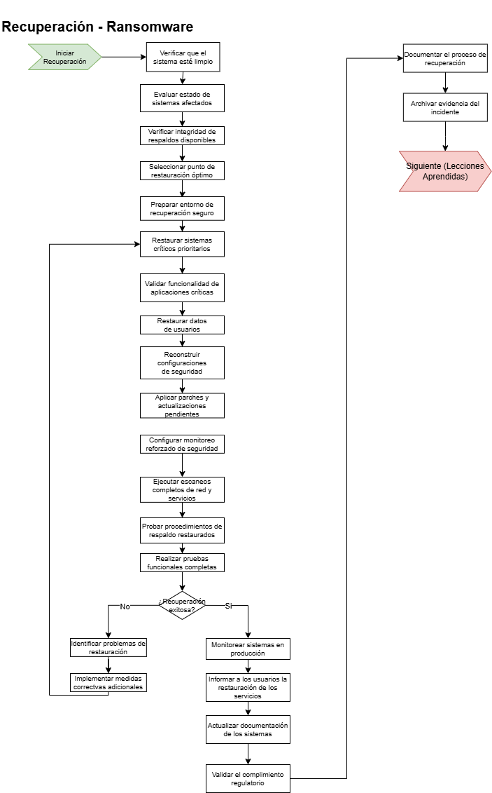
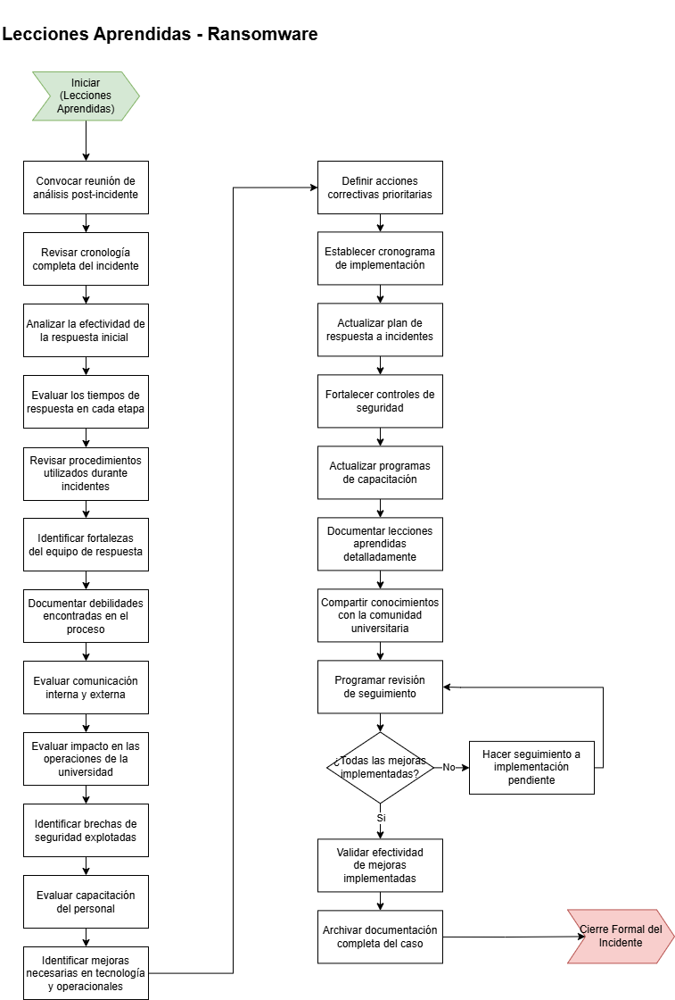

# 🛡️ Playbook 04: Ransomware

**Código:** PB-ULA-004  

**Última actualización:** 02/Agosto/2025 

**Responsable de revisión:** [Nombre o cargo]  

**Tipo de Incidente:** Confidencialidad / Disponibilidad – Infección por Ransomware  

**Versión:** 1.0

---

## 1️⃣ Preparación

**Objetivo:** Establecer los mecanismos preventivos, recursos y responsabilidades necesarias para responder efectivamente a un ataque de ransomware.

### Acciones:

- **Respaldos:**
  - Verificar que se mantengan respaldos actualizados, cifrados y fuera de línea.
  - Realizar pruebas periódicas de recuperación.
- **Inventario de activos:**
  - Mantener un inventario actualizado de servidores, endpoints y servicios críticos.
- **Gestión de acceso:**
  - Implementar MFA y principios de mínimo privilegio.
  - Auditar usuarios privilegiados regularmente.
- **Concientización:**
  - Capacitar a usuarios en identificación de correos maliciosos y prácticas seguras.
- **Defensas técnicas:**
  - Configurar antivirus/EDR con alertas activas.
  - Activar control de ejecución de scripts y macros.
- **Contactos clave:**
  - Definir responsables de TI, comunicaciones, legales, CSIRT y relaciones externas.

---

## 2️⃣ Detección

**Objetivo:** Detectar rápidamente un ataque de ransomware y evaluar su alcance.

### Indicadores de compromiso (IoC):

- Múltiples archivos cifrados o renombrados.
- Notas de rescate visibles en carpetas compartidas.
- Cargas inusuales en CPU/disco en servidores.
- Comunicación de red con direcciones IP desconocidas o en TOR.
- Archivos con extensiones inusuales (.locked, .encrypt, etc.).

### Acciones:

- Verificar logs del EDR y del sistema operativo.
- Consultar usuarios si detectan archivos cifrados.
- Revisar correos reportados como sospechosos.
- Activar el procedimiento de emergencia si se confirma el incidente.
- Contactar al CSIRT Nacional (ANCI) si el impacto es crítico.

---

## 3️⃣ Contención

**Objetivo:** Limitar la propagación del ransomware para evitar mayores daños.

### Acciones:

1. **Desconexión inmediata:**
   - Aislar equipos comprometidos de la red (Wi-Fi, LAN).
   - Apagar servicios afectados si es necesario.
2. **Bloqueo de credenciales comprometidas:**
   - Restablecer contraseñas de usuarios afectados.
   - Suspender cuentas sospechosas.
3. **Control de tráfico:**
   - Bloquear IPs relacionadas al C2 en firewalls.
   - Restringir acceso a unidades compartidas.
4. **Preservación de evidencia:**
   - Evitar formateos o borrados hasta que se capture la evidencia.
   - Tomar imágenes forenses si se cuenta con los medios.

---

## 4️⃣ Erradicación

**Objetivo:** Eliminar el ransomware de los sistemas comprometidos y cerrar vectores de acceso.

### Acciones:

- **Identificar la variante de ransomware:**
  - Consultar bases de datos (ID Ransomware, NoMoreRansom).
- **Eliminar el malware:**
  - Ejecutar análisis con herramientas EDR/AV.
  - Validar que no queden procesos maliciosos activos.
- **Parches y actualizaciones:**
  - Corregir vulnerabilidades que facilitaron el acceso.
- **Revisión de scripts persistentes:**
  - Verificar tareas programadas, claves de registro y servicios sospechosos.
- **Coordinación con autoridades:**
  - Si es grave, colaborar con CSIRT nacional, PDI u otros organismos.

---

## 5️⃣ Recuperación

**Objetivo:** Restaurar la operación normal asegurando que el entorno es seguro.

### Acciones:

1. **Restaurar desde respaldos verificados.**
2. **Validar integridad de sistemas restaurados.**
3. **Monitorear comportamiento post-recuperación.**
4. **Realizar escaneo final del entorno.**
5. **Reincorporar los equipos afectados en fases.**
6. **Notificar oficialmente el cierre técnico del incidente.**

---

## 6️⃣ Lecciones aprendidas

**Objetivo:** Obtener información útil del incidente para prevenir futuros ataques.

### Informe:

- Descripción del ataque (variante, medio de infección).
- Impacto en la operación, número de sistemas afectados.
- Tiempo de detección y contención.
- Costos directos e indirectos.
- Decisiones clave tomadas durante la respuesta.

### Retrospectiva:

- ¿Se cumplieron los tiempos de respuesta?
- ¿Hubo fallos en la detección o contención?
- ¿Qué medidas se implementarán para fortalecer la defensa?
- ¿Se requiere actualizar el plan de respuesta?

---

## 📄 Referencia

- **Fuente base:** Let'sDefend – "Ransomware Playbook"  
- **URL:** [letsdefend.io](https://letsdefend.io)  
- **Email de contacto:** cert.sg@socgen.com  
